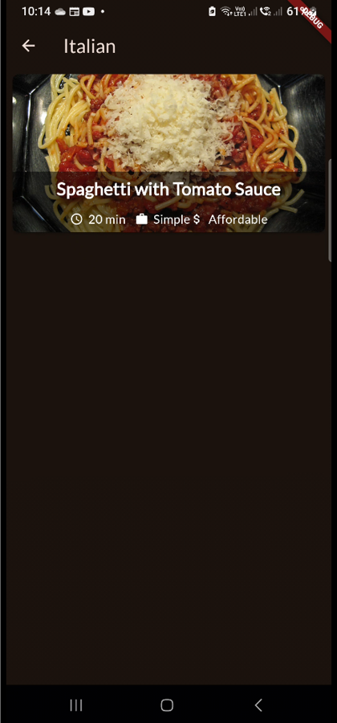

# The Meals App
 

## About:
A recipe that allows users to view recipes and see the instructions and ingredients for the recipe.

## Features:
  - Filters for recipes.
  - Save recipes for later.
## Images:
<table>
  <tr>
    <th>Screen Name</th>
    <th>Screenshot</th>
  </tr>
  <tr>
    <td><strong>Categories Screen</strong></td>
    <td></td>
  </tr>
  <tr>
    <td><strong>Side Draw Open</strong></td>
    <td></td>
  </tr>
  <tr>
    <td><strong>Open a Category</strong></td>
    <td></td>
  </tr>
  <tr>
    <td><strong>Recipe Screen</strong></td>
    <td></td>
  </tr>
  <tr>
    <td><strong>Favorite Screen</strong></td>
    <td></td>
  </tr>
</table>
